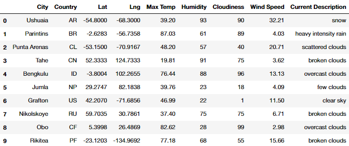
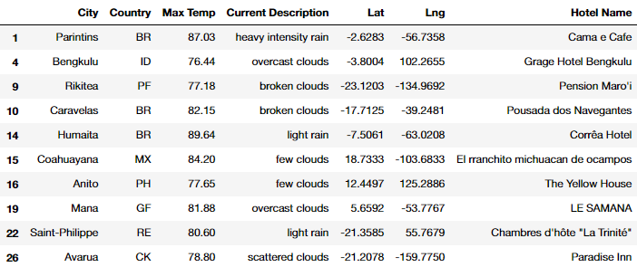
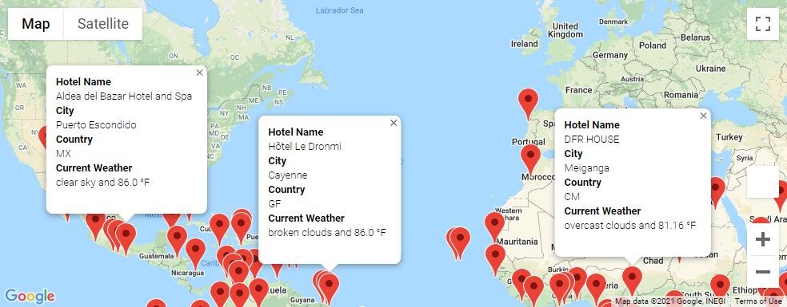
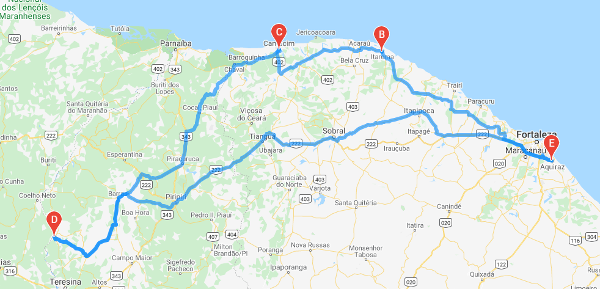
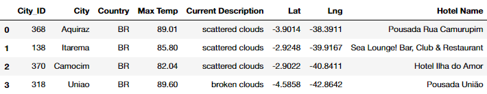
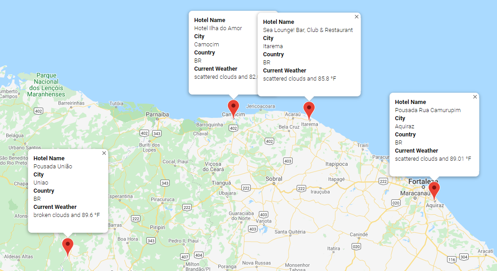

# Challenge - World Weather Analysis

## Challenge - Overview

Through the module we used the OpenWeatherMap API and the Google Maps API/Cloud Platform to plot locations on a map and view their weather data. We randomly generated latitudes and longitudes and used the `citipy` module to find the closest cities. Then we were able to plot graphs and perform linear regression analysis (please see the `weather_data` folder for images). As well as create heatmaps of the weather data we obtained from the OWM API, including Max Temperature, Humidity, and Cloudiness. Our interactions with the Google Maps API during the module included getting a list of hotels from these cities and plotting them on interactive maps, along with information boxes of weather information.

## Challenge - Step 1 - Weather Database

For the module challenge we started by recreating the end of the module work and then took it a step further. First we randomly generating latitudes and longitudes again, found the nearest cities and made API calls to the OpenWeatherMap for each one to gather the weather data we wanted. We put all this data into a DataFrame and then exported it to a CSV file (`Weather_Database/WeatherPy_Database.csv`). Here is an excerpt of the DataFrame:



## Challenge - Step 2 - Vacation Search

We imported the list of cities CSV file we made in Step 1 into our Jupyter Notebook, and prompted the user for a minimum and maximum temperature selection. We then filtered the DataFrame to only show locations that were within the user's selections. Using the GMAPS module and Google Cloud Platform API (`nearbysearch`) we passed in the latitudes and longitudes of our filtered DataFrame and obtained a hotel for each city.

In the instances we weren't able to find a hotel we used a `try-except` block to handle our errors and skip over the problematic city. This list of hotels was added as a column to our main DataFrame:



We continued to use the Google Maps API to then plot each of these latitudes and longitudes onto an interactive map, and included information cards that would appear when a marker was clicked on. This gave the user a good visual idea of what locations were available with the temperature limits they imposed.



## Challenge - Step 3 - Vacation Itinerary

We exported our city weather/hotel list from Step 2 to a CSV file again and imported it into our third Jupyter Notebook, `Vacation_Itinerary`. Here we took the data further than we had in the module, and we used it to create a Travel Itinerary Map. This meant first choosing four locations from our earlier filtered data, and then plotting the directions from one to another.

The four locations we chose were: "Aquiraz", "Itarema", "Camocim", and "Uniao", in Brazil. We began by creating separate DataFrames for each of the cities, and pulling the latitudes and longitudes into paired tuples. This was done with the following code:

```python
vacation_start = vacation_df.loc[vacation_df["City"] == "Aquiraz"]
    ...
start = tuple(vacation_start.to_numpy()[0][5:7])
```

And repeated for all four cities. Then we passed the locations in the `gmaps.directions_layer()` function to create a layer that we could add to our interactive map. This automatic process would plot the route from each city to the next, and back to the beginning:



We finished off this part of the challenge by combining the four destinations into a separate DataFrame, and revisiting Step 2 by plotting their markers on the map and adding the information boxes.





## Context

This is the result of Module 6 of the University of Toronto School of Continuing Studies Data Analysis Bootcamp Course. Following the guidance of the module we end up pushing this selection of files to GitHub.
